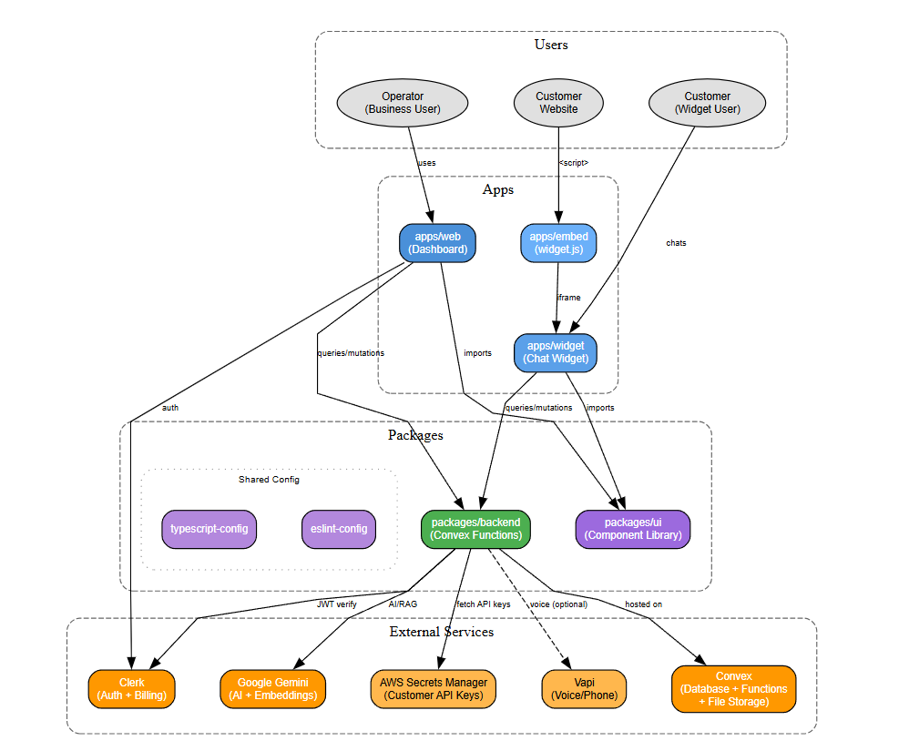

## Samadhan

AI-powered B2B customer support platform. Businesses can set up their own AI support agents with custom API keys, manage conversations via a dashboard, and embed a chat widget on their websites.

Built as a pnpm + Turbo monorepo with Convex backend.

---

## Table of Contents

- [Features](#features)
- [Tech Stack](#tech-stack)
- [Architecture](#architecture)
- [Monorepo Structure](#monorepo-structure)
- [Setup Instructions (Getting Started)](#setup-instructions-getting-started)
   - [Prerequisites](#prerequisites)
   - [Environment Variables](#environment-variables)
   - [Install Dependencies](#install-dependencies)
   - [Run the Apps](#run-the-apps)
- [Contributing](#contributing)
- [License](#license)

---

## Features

- **B2B SaaS** – businesses bring their own API keys and configure their own AI support agents.
- **Dashboard (web app)** – manage conversations, contacts, knowledge base, billing, and integrations.
- **Embeddable widget** – chat widget you can drop into any site via `widget.js`.
- **AI replies** – RAG-based support agent backed by Convex + Gemini.
- **Knowledge base** – upload docs, index them, and answer questions over them.
- **Voice & phone (optional)** – integrate Vapi for voice assistants and numbers.
- **Multi-tenant auth** – Clerk for users, orgs, and plan-based feature gating.
- **Secure key storage** – customer API keys stored via AWS Secrets Manager.

---

## Tech Stack

- **Frontend**: Next.js (App Router), React, Tailwind CSS, shadcn/ui-based `@workspace/ui`.
- **Backend**: Convex (TypeScript functions, RAG + agents, file storage).
- **AI**: Google Gemini + `text-embedding-004` via Convex.
- **Auth**: Clerk.
- **Secrets**: AWS Secrets Manager (for customer API keys).
- **Infra / Tooling**: pnpm workspaces, Turbo, TypeScript, ESLint + Prettier.

---

## Architecture



---

## Monorepo Structure

- `apps/web` – Next.js dashboard for operators.
- `apps/widget` – Next.js app rendered inside the customer-facing widget.
- `apps/embed` – Vite build for the embeddable `widget.js` script and demo page.
- `packages/backend` – Convex backend (schema, functions, RAG, plugins).
- `packages/ui` – shared UI component library.
- `packages/eslint-config` – shared ESLint config.
- `packages/typescript-config` – shared TS configs.

---

## Setup Instructions (Getting Started)

### Prerequisites

- Node.js >= 20
- pnpm
- Convex account
- Clerk account
- Google AI credentials (Gemini API key)
- AWS account (for Secrets Manager)
- Vapi account (optional, for voice features)

### Environment Variables

Copy the example files, then add your own keys:

#### Backend (`packages/backend/.env.example`)

```bash
cp packages/backend/.env.example packages/backend/.env
```

```dotenv
# Convex
CONVEX_DEPLOYMENT=your-convex-deployment
CONVEX_URL=your-convex-url

# Clerk
CLERK_JWT_ISSUER_DOMAIN=your-clerk-issuer-domain
CLERK_SECRET_KEY=your-clerk-secret-key
CLERK_WEBHOOK_SECRET=your-clerk-webhook-secret

# Gemini
GOOGLE_GENERATIVE_AI_API_KEY=your-google-generative-ai-api-key

# AWS Secrets Manager (for storing customer API keys)
AWS_ACCESS_KEY_ID=your-aws-access-key-id
AWS_SECRET_ACCESS_KEY=your-aws-secret-access-key
AWS_REGION=your-aws-region
```

#### Web app (`apps/web/.env.example`)

Create `apps/web/.env.local`:

```bash
cp apps/web/.env.example apps/web/.env.local
```

Then set your own values:

```dotenv
# Convex
NEXT_PUBLIC_CONVEX_URL=your-public-convex-url

# Clerk
NEXT_PUBLIC_CLERK_FRONTEND_API_URL=your-clerk-frontend-api-url
NEXT_PUBLIC_CLERK_PUBLISHABLE_KEY=your-clerk-publishable-key
CLERK_SECRET_KEY=your-clerk-secret-key

NEXT_PUBLIC_CLERK_SIGN_IN_URL=/signin
NEXT_PUBLIC_CLERK_SIGN_UP_URL=/signup
NEXT_PUBLIC_CLERK_SIGN_IN_FALLBACK_REDIRECT_URL=/
NEXT_PUBLIC_CLERK_SIGN_UP_FALLBACK_REDIRECT_URL=/
```

#### Widget app (`apps/widget/.env.example`)

Create `apps/widget/.env.local`:

```bash
cp apps/widget/.env.example apps/widget/.env.local
```

Then set your Convex URL:

```dotenv
NEXT_PUBLIC_CONVEX_URL=your-public-convex-url
```

### Install Dependencies

From the repo root:

```bash
pnpm install
```

### Run the Apps

From the repo root:

```bash
turbo dev
```

This uses Turbo to start all dev targets (dashboard, widget, embed, and Convex backend).

## Contributing

Found a bug or have a suggestion? Open an issue or submit a pull request. Contributions are welcome!

---

## License

This project is licensed under the MIT License. See the [LICENSE](LICENSE) file for details.

---
